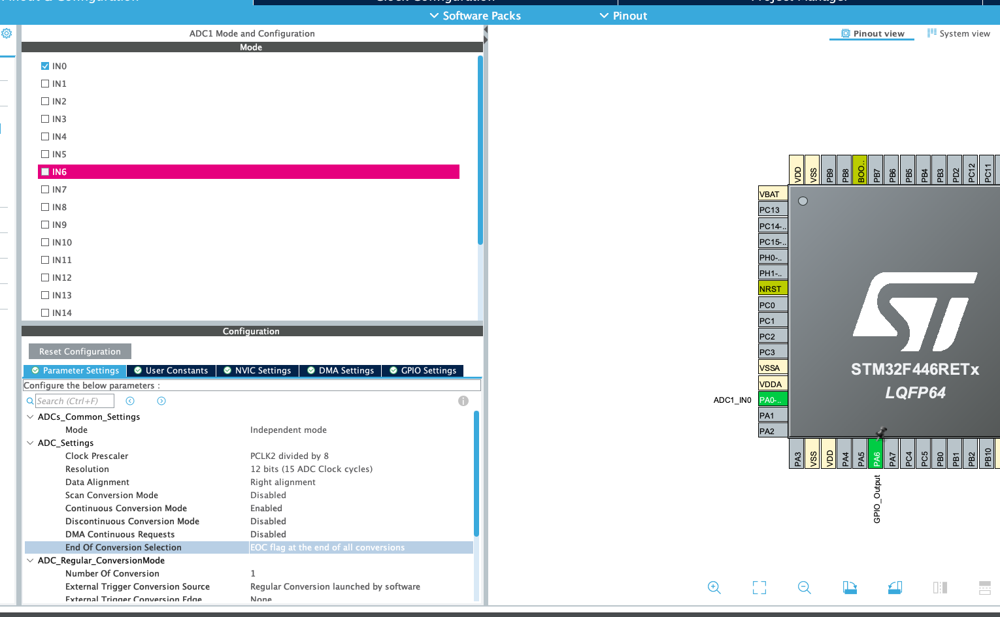
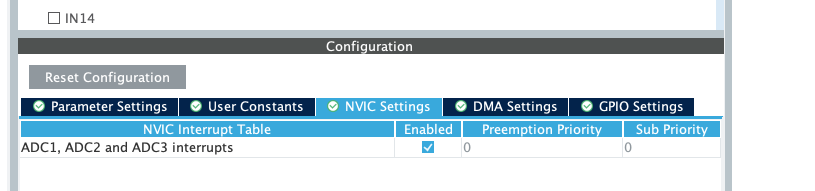
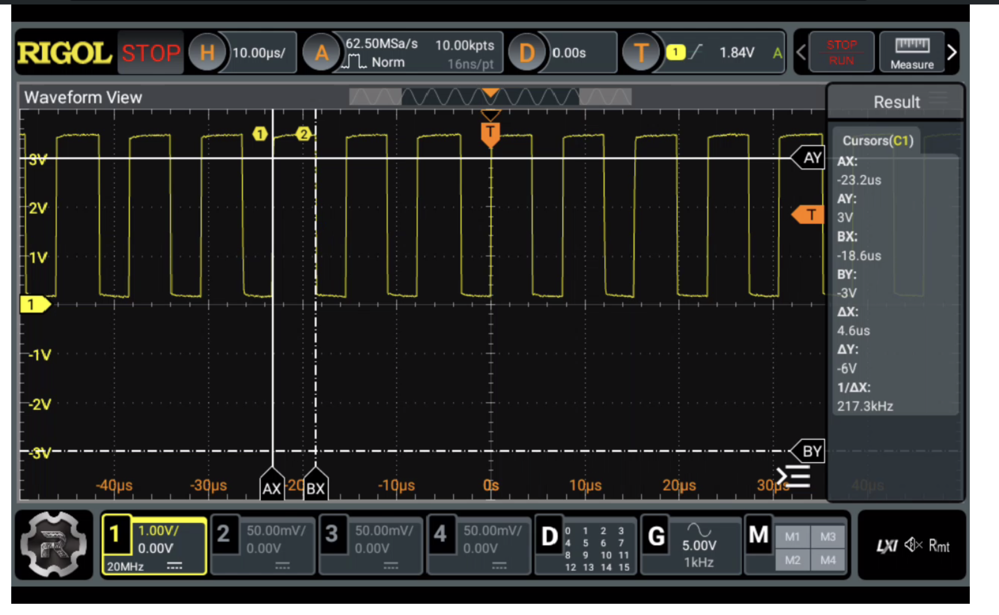
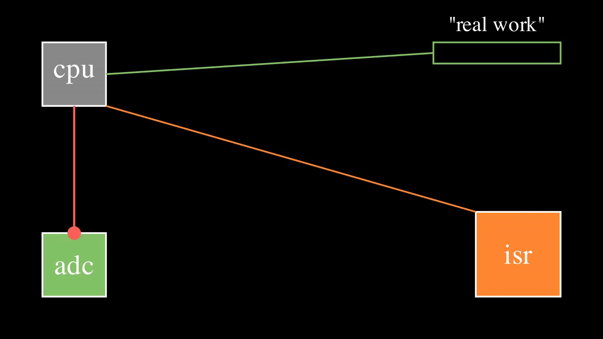

### ADC and DMA

by the way it would be better if you read the one with interrupts first, in the previous article, when
we used only interrupts I said maybe it's bad idea to use them in that context, because the cpu
is being interrupted a lot, i.e a lot of interrupts per second, but how much is it 10 interrupt ot is it 1000000
well let's test it

#### Software Setup to Test interrupt approach




starting the ADC

```c
  HAL_ADC_Start_IT(&hadc1);
```

handling the conversion
```c
void HAL_ADC_ConvCpltCallback(ADC_HandleTypeDef *hadc)
{
	HAL_GPIO_TogglePin(GPIOA, GPIO_PIN_6);
}
```

and here's what I got at PIN 6



``
thus between two interrupt calls is 4.6us as you can see which means that the cpu is getting
1/4.6us  around 217.4Khz, so the cpu is getting 217400 interrupts every second, which is not that
good
``



this is visual way to think of it the faster the ADC the more interrupts, the less time spent on
"real work", that's why we will involve dma to solve this problem