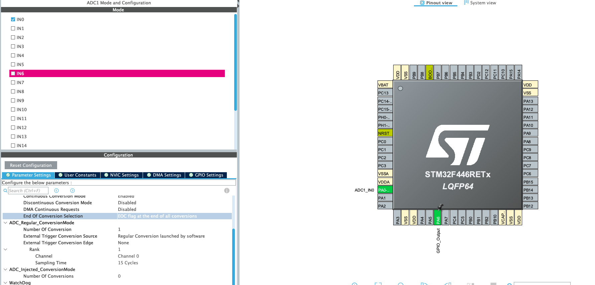

### ADC and DMA

by the way it would be better if you read the one with interrupts first, in the previous article, when
we used only interrupts I said maybe it's bad idea to use them in that context, because the cpu
is being interrupted a lot, i.e a lot of interrupts per second, but how much is it 10 interrupt ot is it 1000000
well let's test it

#### Software Setup to Test interrupt approach




starting the ADC

```c
  HAL_ADC_Start_IT(&hadc1);
```

handling the conversion
```c
void HAL_ADC_ConvCpltCallback(ADC_HandleTypeDef *hadc)
{
	HAL_GPIO_TogglePin(GPIOA, GPIO_PIN_6);
}
```

and here's what I got at PIN 6


``
thus between two interrupt calls is 4.6us as you can see which means that the cpu is getting
1/4.6us  around 217.4Khz, so the cpu is getting 217400 interrupts every second, which is not that
good
``


this is visual way to think of it the faster the ADC the more interrupts, the less time spent on
"real work", that's why we will involve dma to solve this problem, but is dma at the first place?

#### DMA basics
well in this scenario you could think of DMA as co-processor, well not as powerful as processor, 
but, think of our cpu operations in this case, interrupt comes from adc, cpu move's the data
to memory, and get's another interrupt, and again the same, so the cpu is just moving data, so
the cpu is not being used to it's full potential, DMA is good at moving data, in basic words the
cpu will configure dma to say that you should read from adc and write to memory, and cpu goes do 
something else, and we dma is done it will interrupt the cpu so the cpu can process the data, but
again we still getting interrupts did we just come back to the same problem? well no, let's see
why, let's say we configure dma to work with 1000 adc sample, what will happen is that cpu
spends a bit of time to configure DMA at the start to say here's the adc, that you will work with
and here's the memory location that you should store the result,
(yes a small amount of cpu cycles are waster here) but it's worth it you will see, now DMA is 
autonomous, and we it samples the required values it'll notify the cpu (via interrupt), so yes
we are getting interrupted but instead of 1000 times we get it only once, let's see now the details

#### Software Setup


all the options are clear the one that you may not be familiar with is `DMA continuous requests`, with
a bit of search here's what I understood, when ADC is coupled with DMA, and in the case of 
continuous conversion mode, we want the ADC to never stop well you may say that we have done it when
we enabled continuous conversion, well yes we did ADC will not stop the questions are we (cpu) going
to be notified repeatedly, what are the options, that ADC and DMA can run in, well for example
we have configured DMA to work with 1000 words, what will happen is that ADC for every sample it'll
generate DMA transfer request, and when 1000 reached, there's two options either ADC continue sending
requests or stop, this is where `DMA continuous requests` comes in if enabled ADC will not stop triggering
DMA, which in turn using `circular mode` will not stop notifying the (cpu), here's rough animation.

###### DMA continuous request is disabled


as you can see ADC keeps working but it does not interrupt DMA after the first time


###### DMA continuous request is enabled


now you can see that ADC will re-trigger again and again

let's continue!!!


you maybe asking why word will because the function the starts adc and dma takes uin32_t

#### Source Code

```c
#define BUFFER_SIZE 100
uint32_t adc_values[BUFFER_SIZE];
HAL_ADC_Start_DMA(&hadc1, adc_values, BUFFER_SIZE);
void HAL_ADC_ConvCpltCallback(ADC_HandleTypeDef *hadc)
{
	HAL_GPIO_TogglePin(GPIOA, GPIO_PIN_5);
}
```

now let's checkout the results


as you can see now between the interrupts is 260us which is way longer than before, which is what
we want