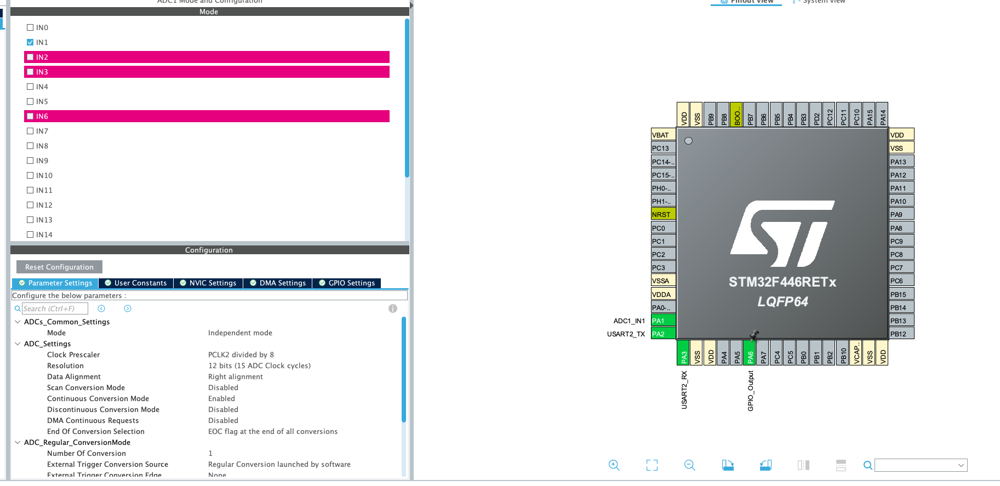
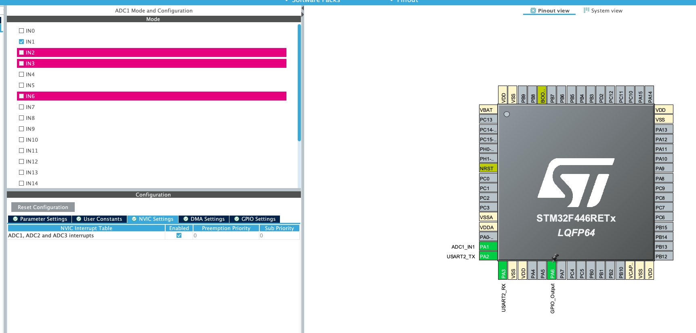
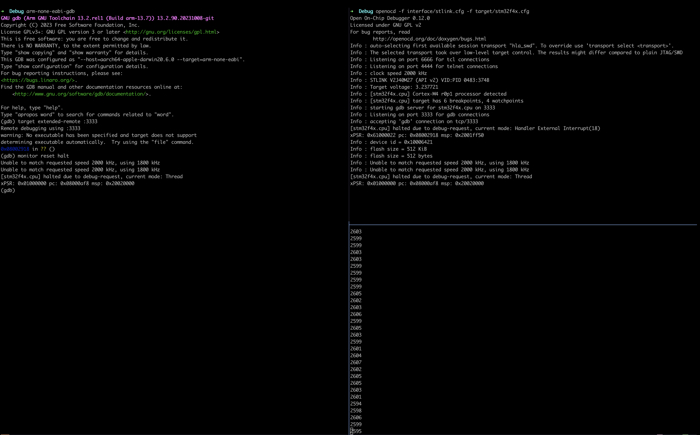

### ADC with Interrupts

well usually it's better to work with interrupts instead of blocking/polling like we did in the previous
project [continuous conversion mode](../continuous_conversion_adc/), so let's see how can we do 
that, BTW i'm not going to explain stuff about ADC you should look here `continuous conversion 
mode` if you want that

### Software Configuration




here's the interrupt
```c
char msg[10];
uint16_t adc_val;
void HAL_ADC_ConvCpltCallback(ADC_HandleTypeDef *hadc){

	HAL_GPIO_TogglePin(GPIOA, GPIO_PIN_6);
	adc_val = HAL_ADC_GetValue(&hadc1);
	sprintf(msg, "%hu\r\n", adc_val);
	HAL_UART_Transmit(&huart2, (uint8_t*)msg, strlen(msg), HAL_MAX_DELAY);
}
```

### Result


the question now is it good approach to do this `interrupt stuff`, well as you can see I'm getting 
a lot of interrupts usually that's bad sign because the way that I think of interrupts is like 
fire and forget system, usually not this fast, we are doing interrupts to make the cpu free, so
it (cpu) can do something else, but now what the cpu is doing is just trying to execute some 
other code and it get's interrupt it handel it and again the cpu tries to get back to work and 
immediately get's the next interrupt and again and again..., it must be a better way, yes next
we are going to use DMA, to leave the cpu "free"
