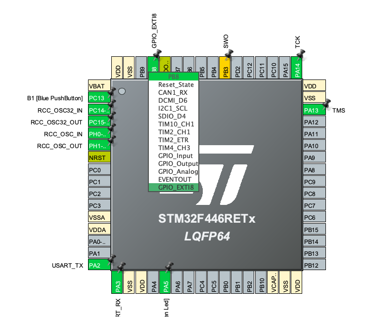
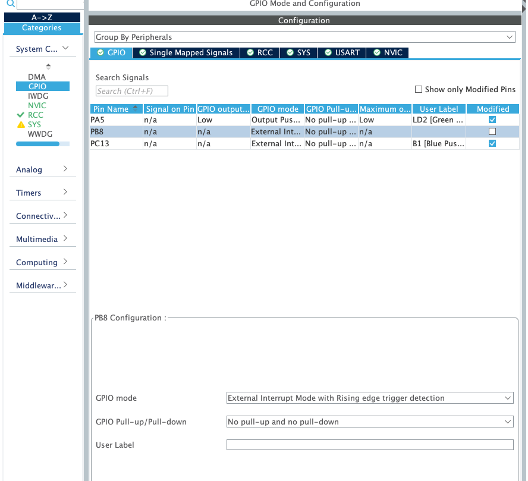
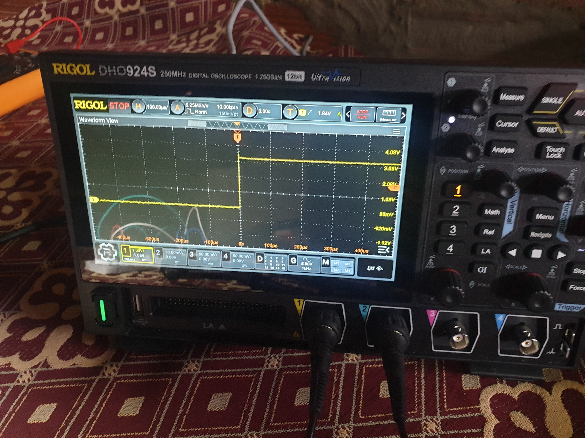

### Button and Built In LED

I'm going to use interrupt instead of polling

#### setup




setup for rising edge for now

#### software

```c
void HAL_GPIO_EXTI_Callback(uint16_t GPIO_Pin)
{
	if (GPIO_Pin == GPIO_PIN_8) {
		HAL_GPIO_TogglePin(GPIOA, GPIO_PIN_5);
	}
}
```

now we define the function that will be called when the pin transition fro low to high because
we setup rising edge interrupt

#### Result




I'm using pull down resistor and I wanted to use capacitor to solve button debounce but I don't
have any capacitor right now, just keep it in mind