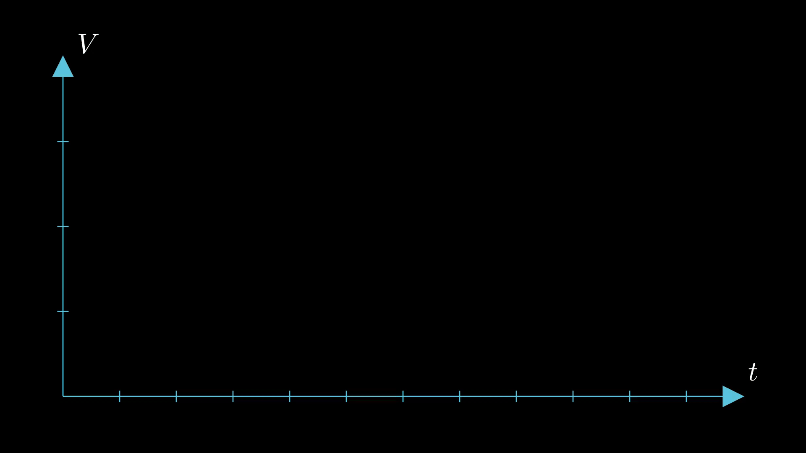
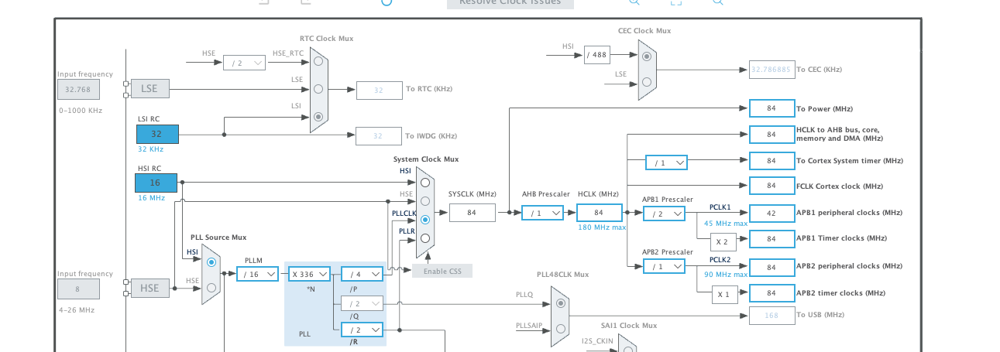
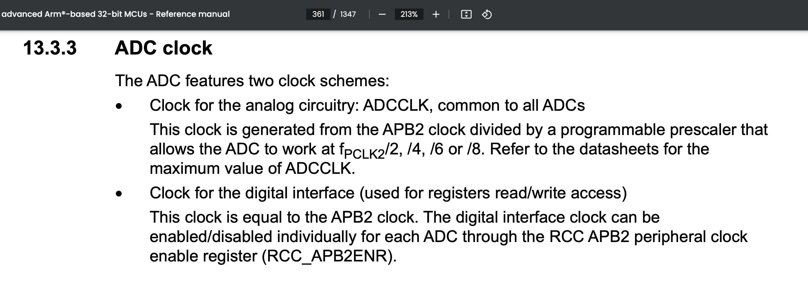
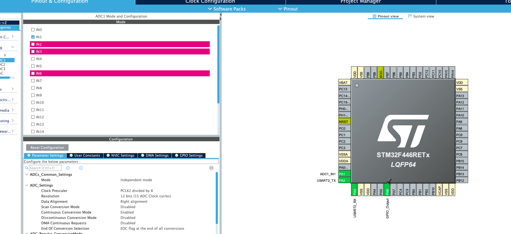
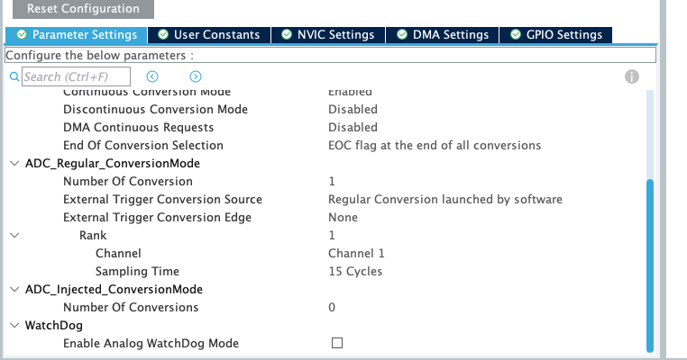
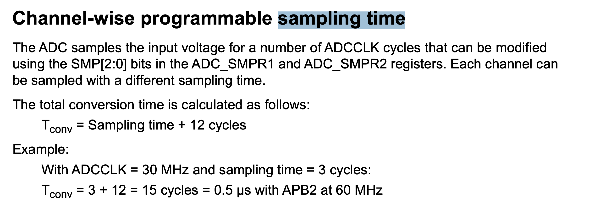
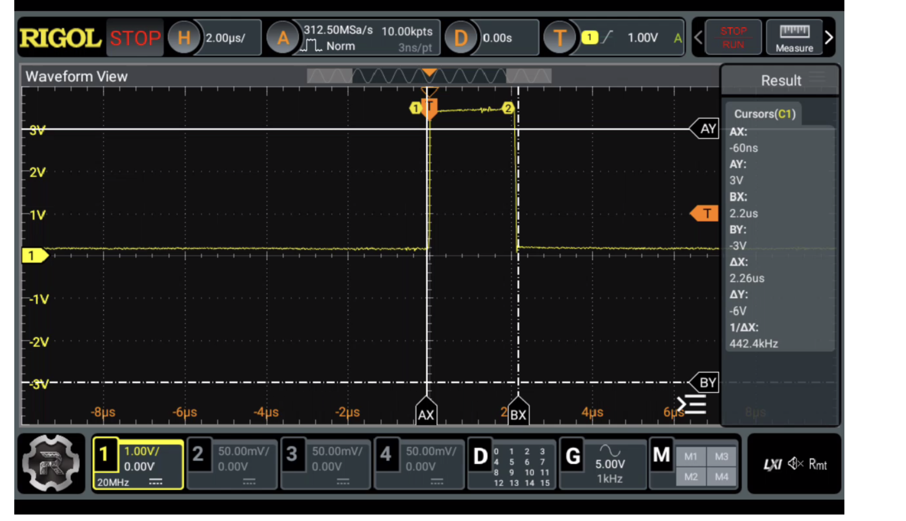

### Continuous Conversion Mode

well we have seen how can we use ADC in the [single conversion mode](../single_conversion_adc/), 
and what does good ADC mean well in that article bit depth the higher the better, but is the only
factor, the decides the quality of ADC?, does more bits enough to reconstruct a signal read by 
ADC, well no because how fast the ADC can sample data is also deciding factor let's assume that
we have signal that is changing fast, but ADC is slow compare to it, well we are going to make
bad reconstruction of the signal, here's a simple input signal



let's say that every step represent 1us, and let's say that ADC can sample at rate of 1 capture 
every 1us, then faster and faster as the figure below you can see the faster the adc can sample
the better the quality so now let's see some numbers enough with the intuition


#### Software Setup

here's the clock configuration that I have



as you can see I have APB2 peripheral clock running at 84Mhz, and that's the input clock to my 
ADC, how do I know that, well from the reference manual



let's now check the pin configuration



I have set pre-scalar to the highest value, so the ADC will be running slow, but why? run it 
slow, well just because I want some values on my scope and If I run it at max speed I might miss
something on my scope for now, and the other option that I have enabled is `continuous conversion mode` well that's self explanatory, and i changed also the `End of conversion flag`, 
because HAL_ADC_PollForConversion is working with that flag if the flag is not set at each 
conversion the function will just block us, and we should change the sampling time also because
to work with 12 bit bit depth we need at least 15 cycles, so let's put set that



so after all how fast the ADC is going to sample you may say that we have 84Mhz and pre-scaler
of 8, that means the ADCCLK=84/8=10.5Mhz, and for every 12bit we need 15 cycles, that would be
15*(1/10.5), that's what I tough also at the start, until I found out this part in the reference
manual



so after all we should multiply (15 + 12 = 27) instead of just 15, that would give us
27/10.5 almost 2.6us

#### Source Code

```c
char msg[10]; // It will be used to send data via uart
uint16_t adc_val; // will hold the value of adc
```

inside the while loop

```c
HAL_GPIO_WritePin(GPIOA, GPIO_PIN_6, GPIO_PIN_SET);
HAL_ADC_PollForConversion(&hadc1, HAL_MAX_DELAY);
HAL_GPIO_WritePin(GPIOA, GPIO_PIN_6, GPIO_PIN_RESET);
adc_val = HAL_ADC_GetValue(&hadc1);
sprintf(msg, "%hu\r\n", adc_val);
HAL_UART_Transmit(&huart2, (uint8_t*)msg, strlen(msg), HAL_MAX_DELAY);
HAL_Delay(100);
```

here I'm just keeping the PIN6 high for to see how much time PollForConversion is taking in 
theory it should be around 2.6us, we are going to see, and the other stuff just sending what
the ADC has read to my pc

### Result

