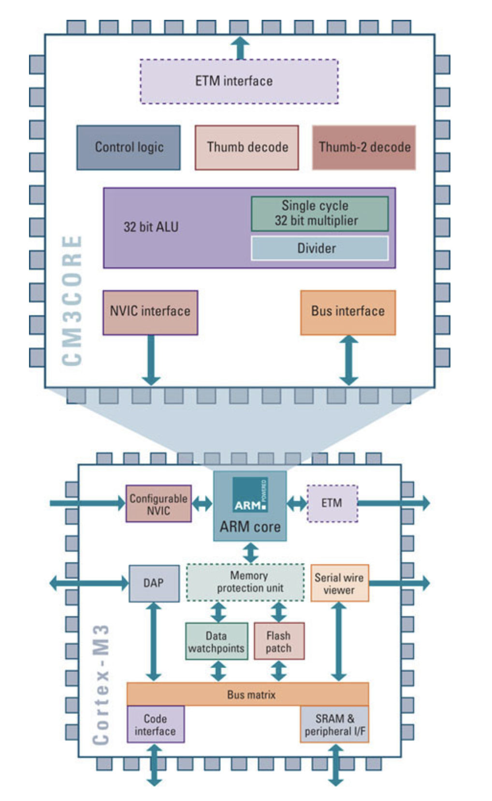
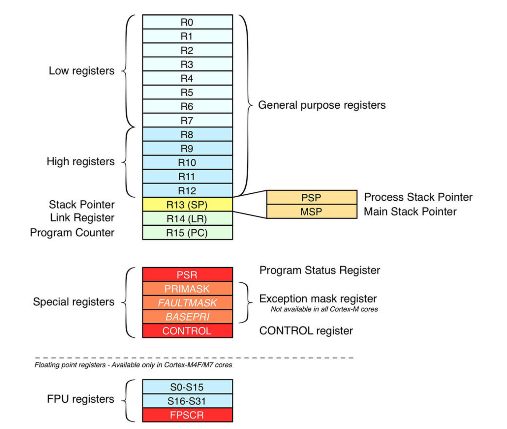
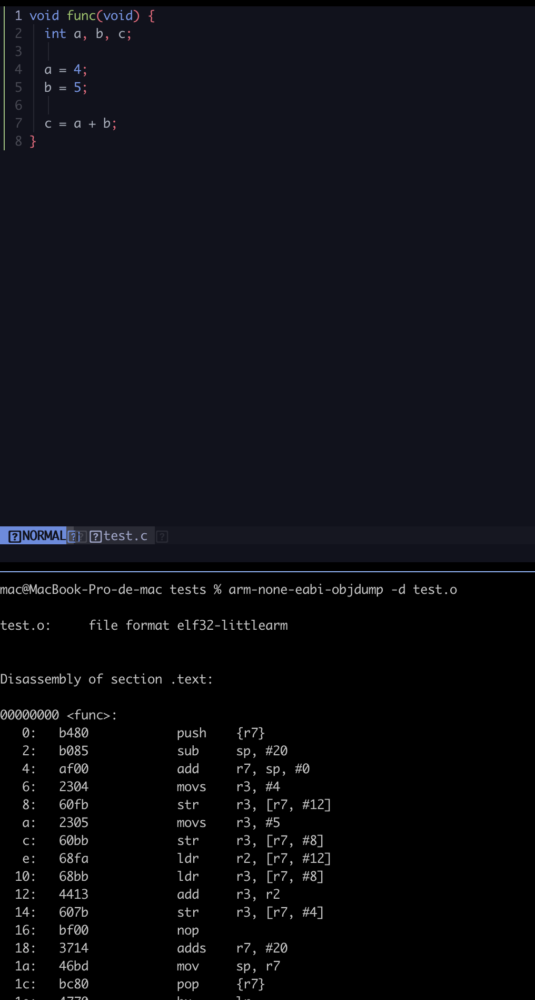
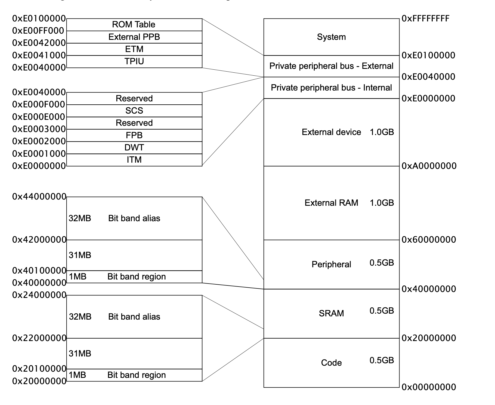

#### Arm architecture
is set of specifications regarding the instruction set, the execution model, ... which describes
precisely a machine that will implement said architecture. if your compiler is able to generate
assembly instructions for that architecture, it is able to generate machine code for all those
actual machines (aka processors) who implements the architecture

#### Cortex-M
is a family of *physical cores* designed to be integrated with vendor-specific silicon devices to
form a micro-controller. The way a core works is not only defined by its related architecture
for example ARMv7 but also by the integrated peripherals and hardware capabilities defined by the
silicon manufacturer. for example the Cortex-M4 is designed to support bit-data access operations
using a feature called bit-banding, here's picture that shows core with relation
to the micro-controller


#### Core Registers
it's like all RISK architectures Cortex-M processors uses load/store instruction and don't
interact with the memory directly "for the most part" there are some special instructions, so we
cannot for example add value to with another value and one of them is stored in memory like we
can in x86 for example
```s
add dword [location], 5
```
but if we are in arm

```s
ldr r2, [r7, #8]
ldr r3, [r7, #12]
add r3, r3, r2
```



let's see an example



as you can see all the instructions involve a register no direct access to memory

```s
push {r7} ; saving frame pointer, its like x86 ebp
sub sp, #20 ; allocating stack
add r7, sp, #0; just trick to move the value of sp to r7
...
```

#### Memory Map
ARM defines a standardized memory address space common to all cortex-M cores. The address space
is 4GB wide, and it is organized in several sub-regions with different logical functionalities



as you can see the first 512MB are dedicated to code area
all cortex-M processors map the code area at address 0x0000 0000 this area also includes the
pointer the the beginning of the stack (usually placed in SRAM) and the *vector table* the
position of the code area is standardized among all other cortex-M vendors, in fact for all STM32
devices an area starting at address 0x0800 0000 is bound to the internal MCU flash memory and
it is the area where program code resides.