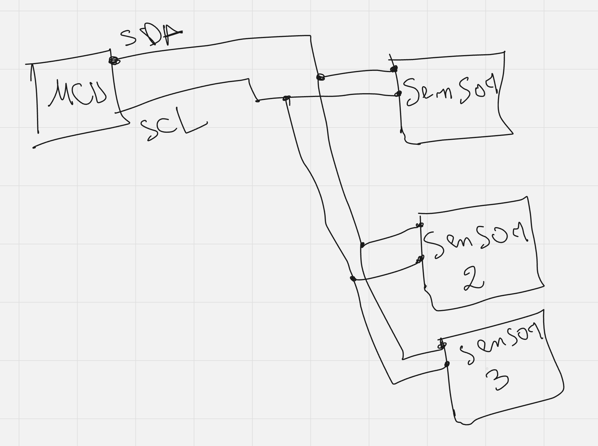
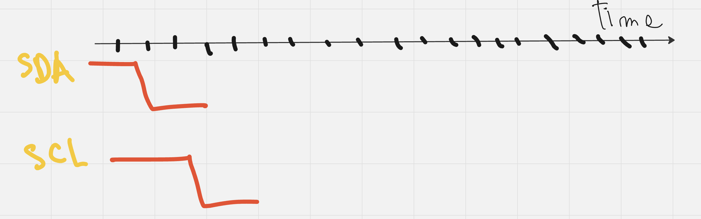
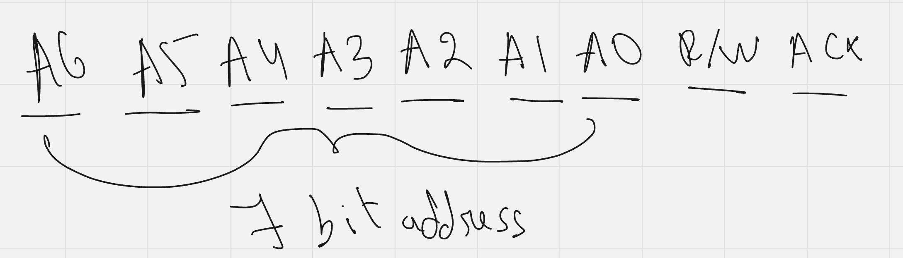
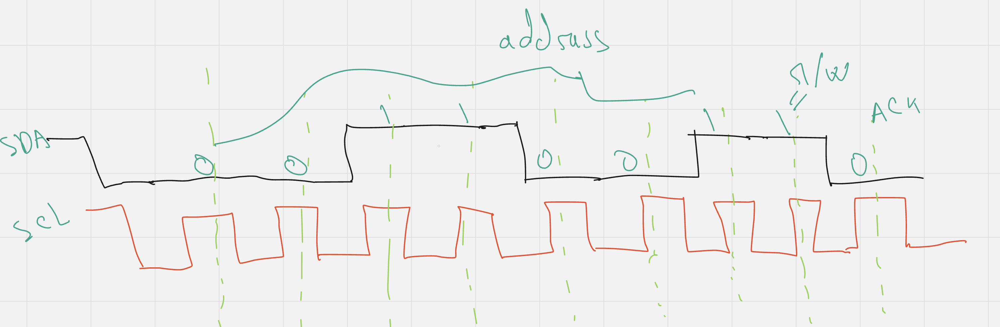

## I2C

how you ever wondered how does data transfer from your sensors to the MCU, well that is where protocols
come's in

well in this protocol we have MCU/MCU'S connected with the sensor/sensors with two lines one for data and
one for clock to sync between them

let's say I want to send some data to *sensor 2* for example well every *sensor/peripheral* has address
so what we do is send address, so the target *peripheral* knows that the MCU is interested in talking to
it, how do the conversation start at the first place? well that follows a pattern, first *SDA* and *SCL*
should be high, so to start conversation what we do is we pull *SDA* down first then we pull *SCL* down after it

now peripherals are ready to be talked to, now we just need to send or receive data but from who (which peripheral?)
we should send address first of the desired peripheral and the address is 7bit long after that there's
bit that specifies is MCU interested in reading or writing, after that there' ack bit if it's 0 it means
that the peripheral got it (peripheral saying that I'm here let's talk)

##### Example

in this example we are saying that we are talking with 0011001=24, and R/W=1 it means the MCU will write
to the peripheral, ack=0 it means that device has pulled that line low saying that I got it,

so now we send data in the same manner  8 bits and after that followed by ack bit
