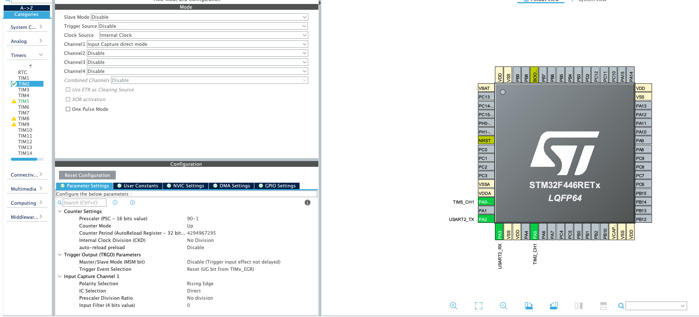

#### Frequency Measurement Stuff
at first when I started learning about timers, I didn't immediately see their use, so I did a bit
of search and I encountered their applications, again a timer is basically counter, what I'm intending
to do here is to measure the frequency of signal with the help of timers, since I don't have external
clock or something to generate some signal I'm going to use another timer to generate PWM signal
I'm not going to focus so much about PWM stuff, and I'm going to use another timer to measure the
frequency of it

##### PWM setup


as you can see I'm working with TIM5 for PWM and I set pre-scalar to 90 I don't need high
frequency for now, and  BTW main clock is 90M and using pre-scalar of 90 means that the timer
is running at 1Mhz and you can see that ARR (auto-reload register) is 100 so the timer will
count up to 99, and if you look down you can see that the puls width is 30, aka duty-cycle is 30%


since we have 1Mhz timer now and ARR=100 it means that we will get pulse every 100/1Mhz so we
should have period of 100us


let's hook up the oscilloscope


it looks right now let's how can timer be used to measure it's frequency, well timers have 
multiple modes that they can operate in, and one of the is called input capture mode what is 
that? well as the name implies when something happens (pin changes on of its channels) value of 
the timer is saved how does help in measuring the frequency let's say I have 1/2Mhz input of PWM
and timer is running at 1Mhz, and first frequency used as input and event occurs like rising edge
of the signal timer will have value let's say 7, so next time timer get's event it will be at 9
we could use these numbers to infer the value of the frequency how well we know that the timer is
running at 1Mhz that means 1us Period so timer is counting at speed of 1us since the timer has 
count up to 2 (9 - 7) that means the amount of  time passed between two rising edges is 2us
which is the period of the signal and the frequency is 1/period 1/2us = 1/2Mhz


but let's say that the first even occurs at the timer final (for example value 7) value, then we 
would get bad result because if we blindly apply the method that we did before we will get for 
example 1 - 7 = -6 negative period which does not make sense we should have 2 well we could do 
this 8 - (7 - 1) = 2

#### Timer Setup


again pre-scalar is 90 so timer is also at 1Mhz, and now we are counting up to it's maximum
(0xffffffff = 4294967295) and it's on rising edge now we just enable the interrupt, and I'll use
UART to display the values later


now let's see the software

here are some includes that I'll use to send data to the pc so I can read it

```c
#include <string.h>
#include <stdio.h>
```

some constants to make it clearer

```c
#define TIMCLOCK 90000000
#define PRESCALAR 90
#define ARR 0xffffffff
```

some global variables that I'll use inside the interrupt
```c
uint32_t val1 = 0;
uint32_t val2 = 0;
uint32_t diff = 0;
int is_first_value_captuered = 0;
float frequency = 0;
```

interrupt handler
```c
void HAL_TIM_IC_CaptureCallback(TIM_HandleTypeDef *htim)
{
	if (htim->Channel == HAL_TIM_ACTIVE_CHANNEL_1)
	{
		if (is_first_value_captuered == 0)
		{
			is_first_value_captuered = 1;
			val1 = HAL_TIM_ReadCapturedValue(htim, TIM_CHANNEL_1);
		} else {
			val2 = HAL_TIM_ReadCapturedValue(htim, TIM_CHANNEL_1);
			if (val2 > val1)
			{
				diff = val2 - val1;
			}
			else if (val1 > val2)
			{
				diff = ARR - (val1 - val2);
			}
			float timerClock = TIMCLOCK/PRESCALAR;
			// period = 1 / timerClock

			frequency = timerClock/diff;

			__HAL_TIM_SET_COUNTER(htim, 0);
			is_first_value_captuered = 0;
		}
	}
}
```

and this is how you should start PWM and IC timer0

```c
HAL_TIM_PWM_Start(&htim5, TIM_CHANNEL_1);
HAL_TIM_IC_Start_IT(&htim2, TIM_CHANNEL_1);
```

and here's the while loop that sends values to the pc

```c
while (1)
  {
    sprintf(msg, "%lu\r\n", (uint32_t)frequency); // BTW just array of chars char msg[10];
    HAL_UART_Transmit(&huart2, (uint8_t*)msg, strlen(msg), HAL_MAX_DELAY);
    HAL_Delay(100);
  }
```

so let's test it


which is good 10000hz = 10khz which is right, but did you notice that we may have problem what
if we have fast signal faster than our timer let's see what will happen


as you can see we'll get the same value for the two events what can we do now? let's first see
some numbers to analyze it more let's say that the signal is 2Mhz and the timer is 1Mhz, 
that means in 1us the signal rising edge will be detected 3 times aka 2 periods so in 1us there's
two periods thus one period took 1/2us thus frequency of 2Mhz, so as you can see we can get the
value of higher frequencies


here's the new function and this `event_counter` just global variable

```c
void HAL_TIM_IC_CaptureCallback(TIM_HandleTypeDef *htim)
{
	if (htim->Channel == HAL_TIM_ACTIVE_CHANNEL_1)
	{
		if (is_first_value_captuered == 0)
		{
			is_first_value_captuered = 1;
			val1 = HAL_TIM_ReadCapturedValue(htim, TIM_CHANNEL_1);
		} else {
			val2 = HAL_TIM_ReadCapturedValue(htim, TIM_CHANNEL_1);
			if (val2 > val1)
			{
				diff = val2 - val1;
			}
			else if (val1 > val2)
			{
				diff = ARR - (val1 - val2);
			} else
			{
				// the same so maybe higher frequency
				++event_counter;
			}
			if (val1 != val2) {

				float timerClock = TIMCLOCK/PRESCALAR;
				frequency = timerClock/diff;

				if (event_counter != 0)
				{
					frequency *= event_counter;
					event_counter = 0;
				}

				__HAL_TIM_SET_COUNTER(htim, 0);
				is_first_value_captuered = 0;
			}
		}
	}
}
```

as you can see it's doubled


what about when the signal is super slow, well that's for another day