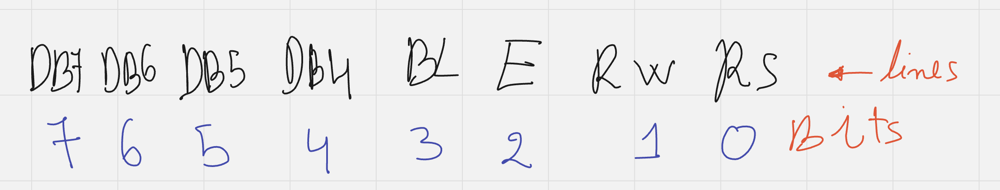

### LCD and Stm32

###### Assumption
- you should know i2c if not go [here](../explained/i2c.md)

I want to print data on LCD that is the goal of this projects


as you can see it has a lot of pins that would require a lot of wiring between lcd and stm32,
which I'm not fan of

#### Lcd Pinout


the problem of lot of wires can be solved using GPIO expander such as PCF8574 that uses I2C 
protocol, I have old LCD that comes with arduino kit before which is already connected with GPIO
expander I looked some wiring stuff online, I'll try it

#### Lcd and PCF8574 Wiring


the question now is what values should we assert to what pins of lcd, well let's  look in the datasheet

#### Pins


you can see that some pins are easy to understand (Vss, Vdd, V0, A+, K-), but other's I can only
guess for now (RS, R/W, E, DB0-DB7)

so let's dig deeper to see what are these values

from here I guess that we can work with lcd in two modes 8bit and 4bit in our case you can see 
from the previous wiring that only (DB4-DB7) are connected with GPIO expander so we are working
with 4bit mode, and you can see that in order to init this lcd we need to set the pins to what
the datasheet says and BTW this on page 6 of datasheet


look carefully on RS line you can see that when we are configuring the lcd (for example use 2 lines instead of one) RS is always 0 but when we write data it's 1 BTW this page 7

- RS: 0 for command 1 for data
- R/W: 0 for writing 1 for reading

what about E? well you can see it in Timing Control


from this you can see that RS and R/W are independent in terms of timing but both of them should
in it's final value before E line goes High (H) by tAS=100ns, after that I believe that DB0-DB7
not dependent on E PIN when it's rising but as you can see with (tDSW, tDHR) when E is going
that should be valid before by (tDSW) and should hold tDHR after it goes down.
so in short I believe that I could do something like this setup the correct value of RS, R/W and
DB0-DB7 and set E line to 0, and switch to 1 to aka E going HIGH wait for (PWEH), and switch back
to 0, wait for (tDHR)

#### Note
take look at software example section you may understand more

##### Software
1. setup i2c in stm32 ide


2. setup i2c1


press on it you will see a dropdown select i2c


since PB6 AND PB7 are far from each other I'm going to change them to PB8 AND PB9


3. we need to init so we need to wait for bit 15ms to exact after Power On I'll wait more just
to be on the safe side from data sheet we need to set


from the previous wiring picture you can see this



now we are going to send this


keep in mind that we can either send instructions for configuration or data to be displayed
first of all we are going to need to send some instructions to configure lcd

- function set: specifically 4 bit mode and 2 lines and 5x10 dots for the font
    - 0001: 4-bit mode
    - 1100: 2 lines and 5x10 dots
- clear display:
    - 0000
    - 0001
- return home:
    - 0000
    - 0010
- display on/off control: is display on and cursor control
    - 0000
    - 1111: display on cursor on and blinking

in order to execute that `function set` stuff
we need first to send 0001 and then 1100 so we should send 0001_1100 why that 1100 well 1 for backlight and 100 zero for rs and zero R/W and for and E pin is high and I'l wait for a bit then
send the same bin except E pin should become low and wait for a bit again so the instruction is 
sampled by lcd. and we repeat that for the second part and so on it'll be better if we make some
function so it's easier

first of all of what we'll send is going to Turn on and off that E line, so that's good candidate
for a function


```c
void transmit_wrapper(uint8_t data) // just to make it simpler
{
	HAL_I2C_Master_Transmit(&hi2c1, DEVICE_ADDRESS, &data, 1, 100);
}

void write_data(uint8_t data)
{
	transmit_wrapper(data | ENABLE_PIN_ON); // setting E pin to high
	HAL_Delay(1); // E line is high for 1ms which is enough
	transmit_wrapper(data & ENABLE_PIN_OFF); // setting it low
	HAL_Delay(1); // wait for wail
}
```

now I could use them like this for example for the function set

```c
write_data(0b00010x00); // that x means it does not matter because inside the function it will change
write_data(0b11000x00);
```

since most of the commands are 8 bits so we need to do 2 write_data that could be function also

```c
void send_word(uint8_t w, uint8_t rs)
{
	uint8_t high_part = w & 0xf0;
    // line above clear first 4 bits aka keep 4 upper bits intact
	uint8_t low_part = (w << 4) & 0xf0;
    // move first bit to the left then clear the first 4
	write_data(high_part | rs | backlight_state);
	HAL_Delay(1);
	write_data(low_part | rs | backlight_state);
	HAL_Delay(1);
}
```

so now all we need is to config lcd and send some commands

```c
void lcd_config(void)
{
	// function set with 2 lines and 5x10 dots for the font
	send_word(0b00011100, 0);
	// clear display
	send_word(0b00000001, 0);
	// return home
	send_word(0b00000010, 0);
	// display on/off control
	send_word(0b00001111, 0);
}
```

now we can start sending characters let's make wrapper for send_word just for characters aka data
so rs should be 1

```c
void send_char(char c)
{
	send_word((uint8_t)c, 1);
}
```

since I'm working with 2 lines I'll need to move the cursor to the next line so let's make it
a function also

```c
void set_cursor_to_line(uint8_t line_number)
{
	// maybe a check later value should be 0 or 1 that's it
	if (line_number == 1)
		send_word(0b11000001, 0);
	else
		send_word(0b10000000, 0);
}
```


#### Final Result

