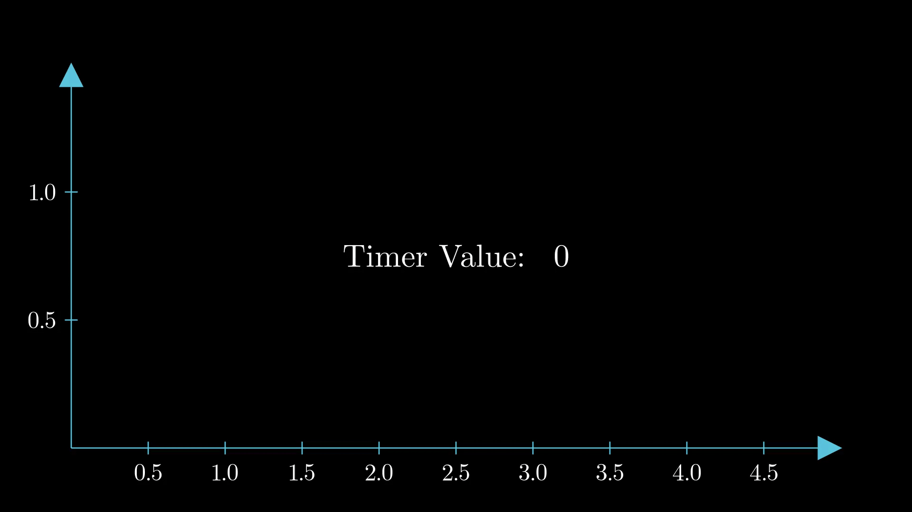
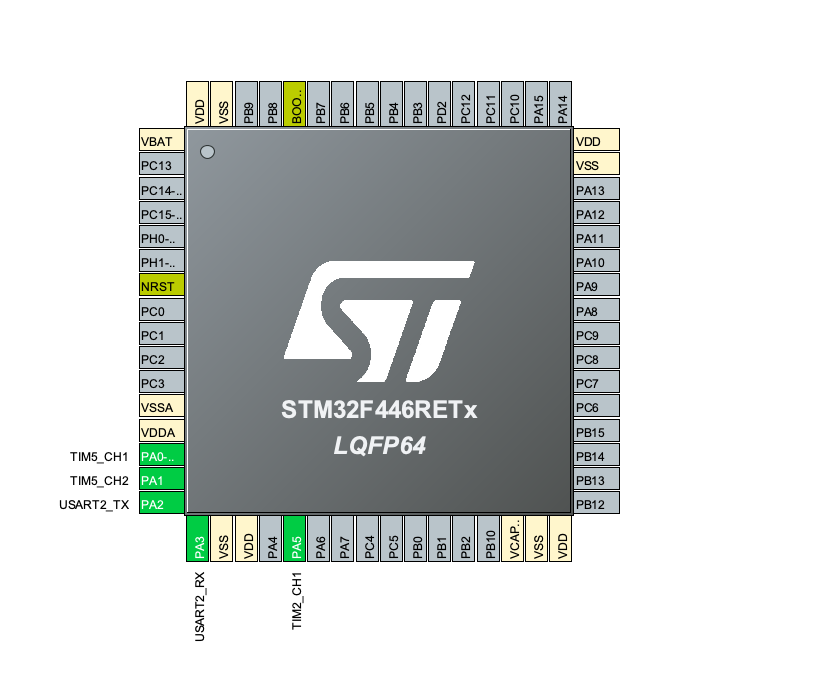

### Measuring PWM duty cycle using timers
first let's recap what is duty cycle at the first place? well it's just how much signal of PWM
is high compared to low, for example let's say that we have with period of 100us and it's high for
25us that would give us (25/100)*100% = 25% duty cycle

the idea here is to measure duty cycle what do we need to measure duty cycle, we need to see
how much the signal is high compared to low, we could use input capture mode, like I did in this one
[frequency measurement](./frequency_measurement_with_timers/), so the idea is to set 
interrupt on rising edge but with that we can only get period, I will add another interrupt that
will be triggered on the falling edge in this example I'll get first rising edge interrupt save
value of the timer at that point, then I'll get falling edge interrupt save a second value of the
timer that would give me how much time the signal is high but that would only give me the width
so we will wait more for the next rising edge and register that as third value, we can use this
third value with the first value to get period and now we have period and width I can use them to
get duty cycle, let's say that I have 1Mhz timer aka it's increasing at rate of 1us=1000ns

so for example we get interrupt at rising edge of PWM signal we save the value of the timer at
that point let's say it's 9, after 25us we get another falling edge interrupt the timer will be
9+25=34, and another rising interrupt at 9+100=109, so now we have these three numbers 9, 34, 109
period = 109 - 9 = 100us and width = 34-9 = 25 so duty cycle is 25%, you may see another if 
statements in the source code that you don't understand if so please refer to this
[frequency measurement](./frequency_measurement_with_timers/)

### Software setup

### Result

