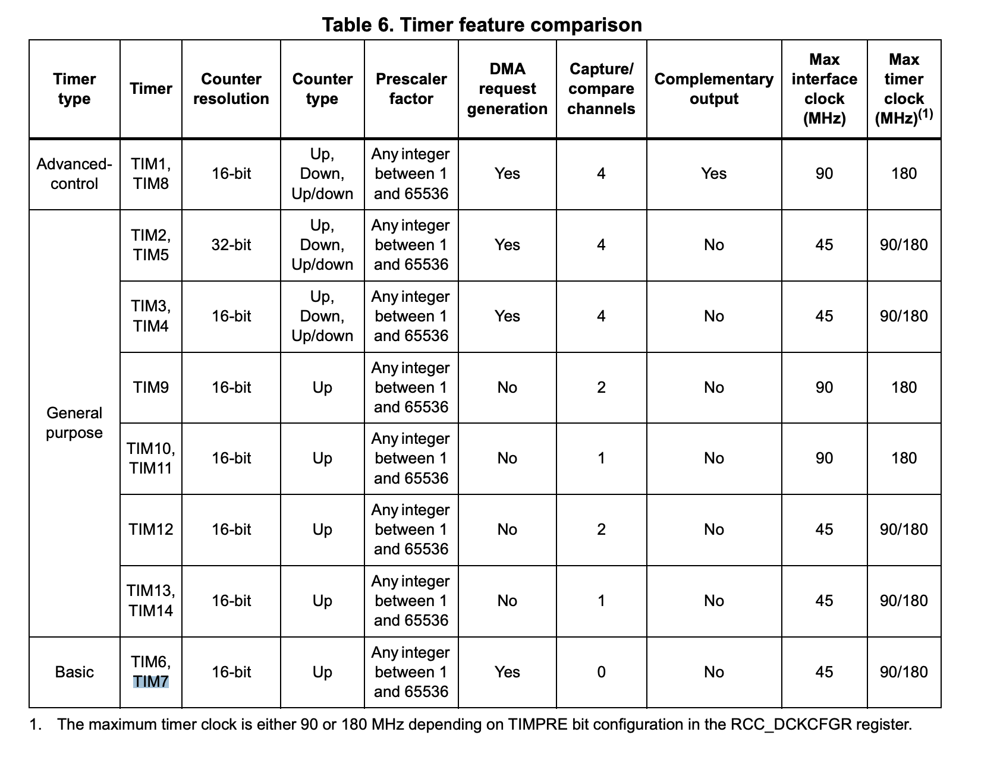
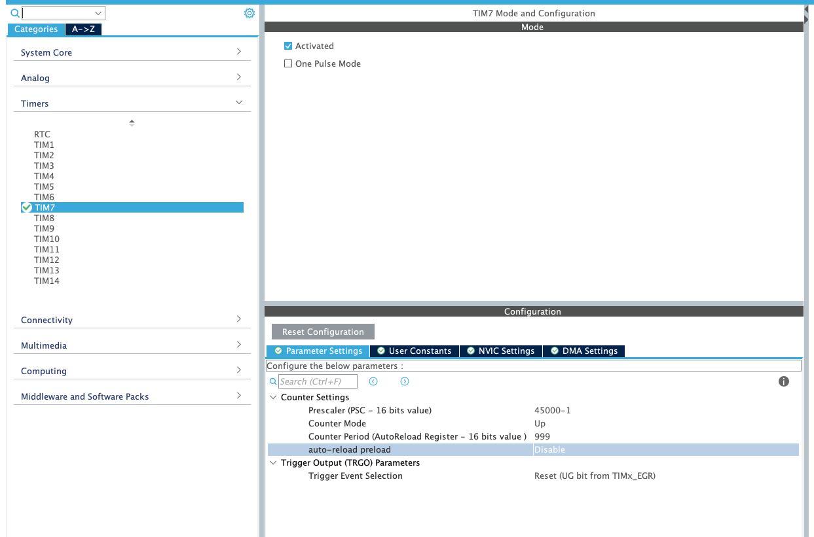
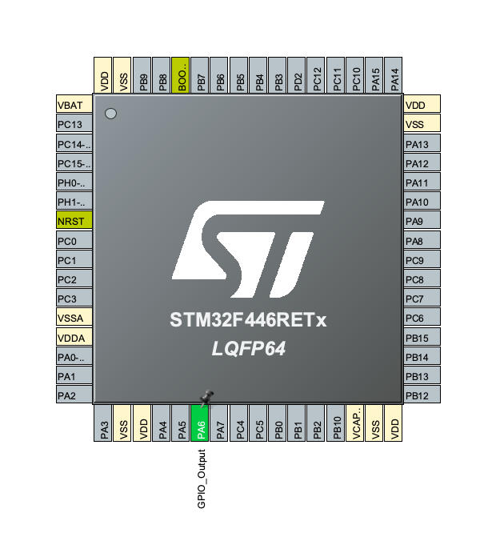
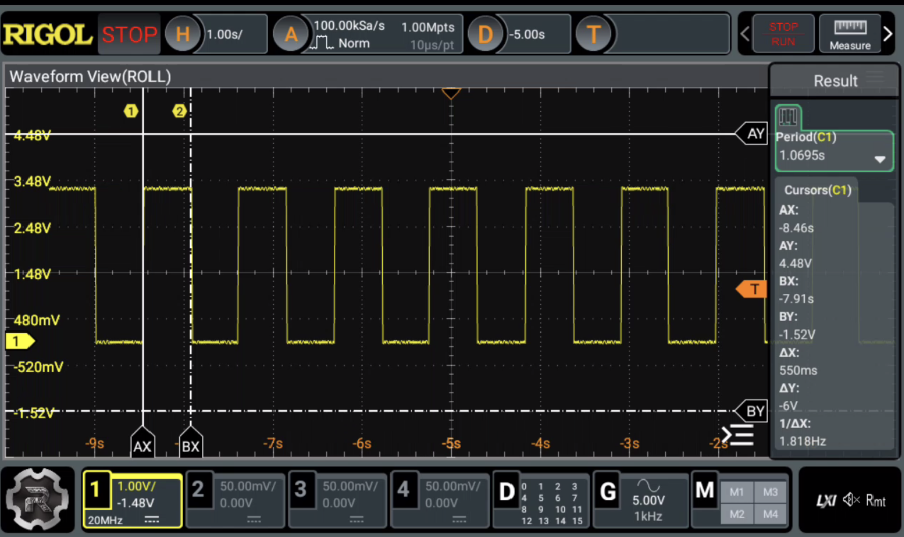
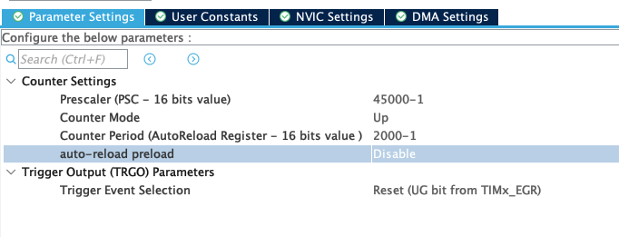
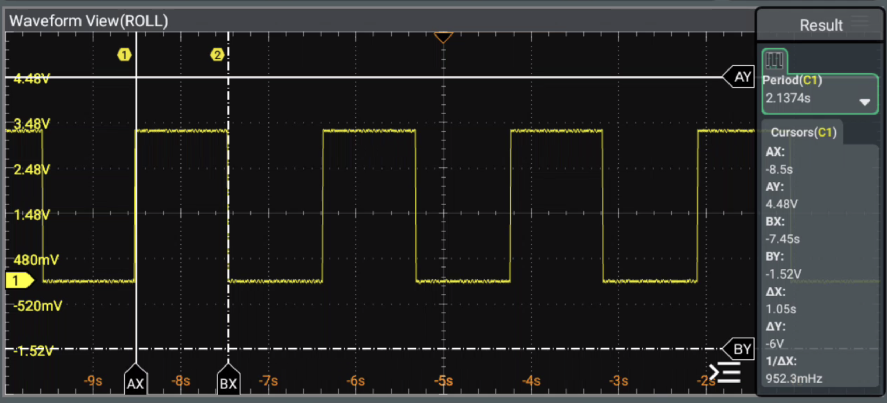

### Non Blocking Blink

I'll use timers to achieve the desired result how, well I intend to configure a timer so I get
interrupt every 1 second



in this case we don't need some advanced features from the timer, so I'm going to use tim7
as you can see it operates at 45Mhz so I could use pre-scaler of 45000 to make the timer run
at 1Khz = 45Mhz/45000



with period of 1 / 1Khz we got tick every 1ms so that means if we count up to 999 effectively
counting 1000 times it would take the timer 1s to reach it, let's see

I'm going to use another pin as output just to see am I right about the timing



starting the timer

```c
HAL_TIM_Base_Start_IT(&htim7);
```

setting up the interrupt to toggle the pin

```c
void HAL_TIM_PeriodElapsedCallback(TIM_HandleTypeDef *htim) {
	UNUSED(&htim);

	HAL_GPIO_TogglePin(GPIOA, GPIO_PIN_6);
}
```

### Result


something seems wrong I was expecting 1s and I'm getting 1/2 second I tried my math again and it seems
solid I don't if I was wrong about the clock maybe 90, but for now I'll just count up to 2000



### Second Result


now it seems good and you still have empty while(1) you can put other stuff there