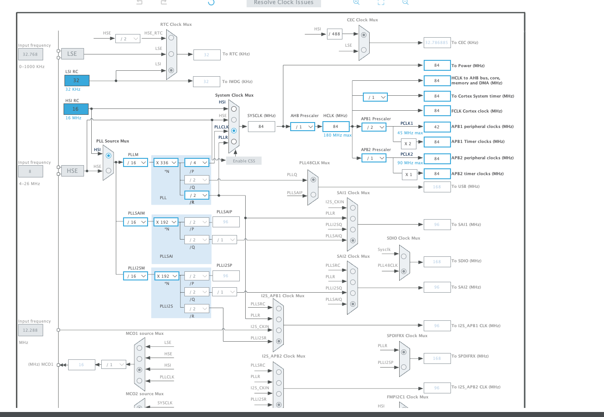

#### Timers 101

since I used PWM in other project I used timers and I did not explain them there, I'll make a simple
timer project to illustrate some basic stuff about timers, well what are timers, in short just
counter you know (0, 1, 2, ...), but that seems useless? well no here's some of what you can do by
simply counting

- PWM: timers can generate PWM signals for controlling stuff that is not digital needs analog signals
think of your PS5 controller, motor with different speeds, ...
- Input Capture
- Delay Generation
- even counting : like how many times a button was pressed
- and a lot more

timer has something called pre-scaler that will divide the input clock by some factor to slow it down
since timers are usually connected to main clock which is way fast, at least for me now, so in this 
tutorial we'll illustrate that fact

#### Software Setup




now let's start the timer

```c
HAL_TIM_Base_Start_IT(&htim1);
```

now I'm defining the call back that will be called when the timer reach's 999

since the pre-scaler is the same as the source clock the timer should run in 1Mhz, and with timer
counting up to 999 that means we should get interrupt every 1Mhz*1000 = 1ms at least in theory
we'll check it with oscilloscope

```c
void HAL_TIM_PeriodElapsedCallback(TIM_HandleTypeDef *htim)
{
  /* Prevent unused argument(s) compilation warning */
  UNUSED(htim);

  /* NOTE : This function should not be modified, when the callback is needed,
            the HAL_TIM_PeriodElapsedCallback could be implemented in the user file
   */
  HAL_GPIO_TogglePin(GPIOA, GPIO_PIN_11);
}
```

### Result


