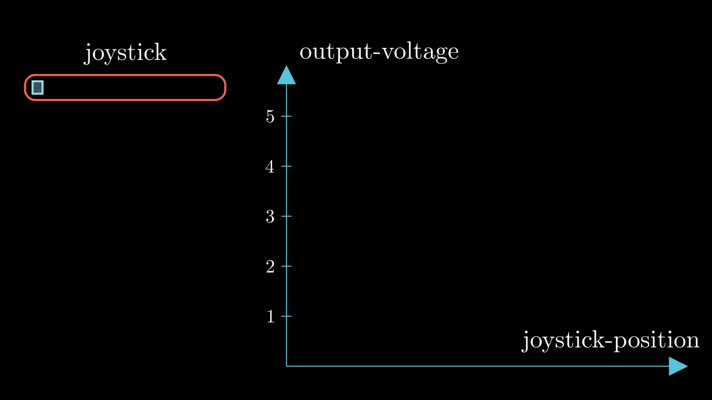

### Single Conversion Mode ADC

I frequently encounter situations where I need to work with analog values, think of temperature sensor
joystick,..., so this article should help you understand how to work with ADC specifically on stm32f4

#### ADC
what is ADC at the first place well it's just device that converts analog input to digital output,
assume you have joystick in the x-axis, when the stick on the left all the way the output voltage is
zero, and when it's all the way to the right it's 5V, and if in between output is in between also
role of ADC is to read that value and map it digital value that we can work with, let's see some
properties of ADC ic, well there's bit depth, numbers of bits that represents the output, for example
adc with 1 bit, will either output 1 or zero depending on the input for example if value is zero (joystick to the left)
adc says zero, if on the right we get one but is this really useful well no because what about 4.5V
that also will give us 4.5V which is not really that accurate



because when the value is in deep blue region we will get zero, and in the other area (PINK) will
get 1, but if the bit depth is increased we got more accurate, more regions you could say, anyway
think of it as black box that will take the analog value and map it to number

#### Software Setup


I changed only the rank to make the sample time 15 cycles, why well as you can see to use 
resolution of 12bits adc needs 15 clock cycle to complete the reading, other than that I have 
changed nothing, let's see the software

```c
HAL_ADC_Start(&hadc1); // staring ADC peripheral
```


I need them to send what the ADC read via UART to my screen
```c
char msg[10];
uint16_t adc_val;
```

here's all the code

```c
HAL_ADC_Start(&hadc1);
HAL_ADC_PollForConversion(&hadc1, HAL_MAX_DELAY);
adc_val = HAL_ADC_GetValue(&hadc1);
sprintf(msg, "%hu\r\n", adc_val);
HAL_UART_Transmit(&huart2, (uint8_t*)msg, strlen(msg), HAL_MAX_DELAY);
HAL_Delay(100);
```

### Setup/Result


but as you can see we to read multiple values form the ADC we Start, inside the loop which is not
good, later, we will see another way to start the ADC only once